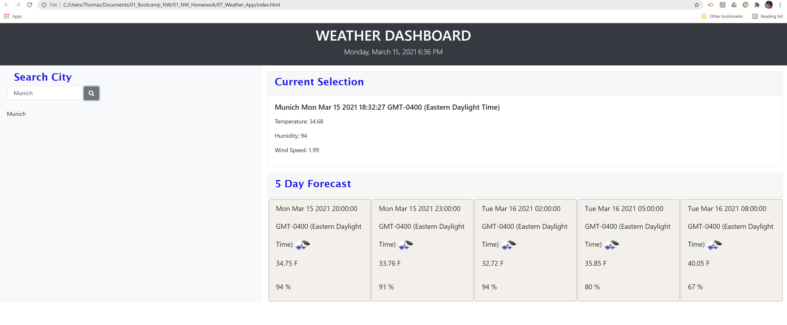
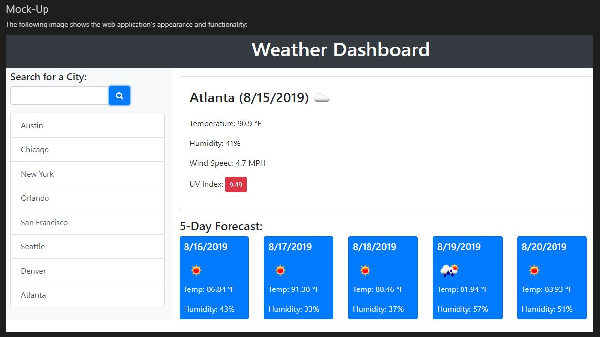

# 07_Weather_Dashboard - Thomas Schmidt
Weather Dashboard Homework using jQuery and 3rd Party API

## Programming Information
The program was written with jQuesry and dynamic appendance of search results, as well as bootstrap.
The following third party APY are applied:
    - https://momentjs.com/
    - https://openweathermap.org/api // for current weather search results
    - https://home.openweathermap.org/api_keys // for 5 day weather search results
It is recognized that the use of one openweathermap.org api link / key would could have been suitable. 
Reasoning for selecting two is:
    - independance of displaying search results, which prevents that a loading failure would result in no 
        search results at all
    - Simplicity in code structure for trouble  shooting

Local Storage is used to store search results. Results can be recalled when clicking on the respective city. Dublications should not occure.

*_*_*_*_*_*_*
The 5 Day Weather Forecast includes a time element. The conversion of of UNIX time to standard time caused some challange. 
*_*_*_*_*_*_* 

The UV display was not completed!

## Styling
The style has been kept simple without additional features

## Acceptance Criteria

GIVEN a weather dashboard with form inputs
WHEN I search for a city
THEN I am presented with current and future conditions for that city and that city is added to the search history
WHEN I view current weather conditions for that city
THEN I am presented with the city name, the date, an icon representation of weather conditions, the temperature, the humidity, the wind speed, and the UV index
WHEN I view the UV index
THEN I am presented with a color that indicates whether the conditions are favorable, moderate, or severe
WHEN I view future weather conditions for that city
THEN I am presented with a 5-day forecast that displays the date, an icon representation of weather conditions, the temperature, and the humidity
WHEN I click on a city in the search history
THEN I am again presented with current and future conditions for that city

## Mock-Up

Weather Dashboard - Thomas Schmidt Homework

The following image shows the web application's appearance and functionality:

## Grading Requirements

This homework is graded based on the following criteria: 

### Technical Acceptance Criteria: 40%

* Satisfies all of the above acceptance criteria plus the following:

    * Uses the OpenWeather API to retrieve weather data.

    * Uses `localStorage` to store persistent data.

### Deployment: 32%

* Application deployed at live URL.

* Application loads with no errors.

* Application GitHub URL submitted.

* GitHub repository that contains application code.

### Application Quality: 15%

* Application user experience is intuitive and easy to navigate.

* Application user interface style is clean and polished.

* Application resembles the mock-up functionality provided in the homework instructions.

### Repository Quality: 13%

* Repository has a unique name.

* Repository follows best practices for file structure and naming conventions.

* Repository follows best practices for class/id naming conventions, indentation, quality comments, etc.

* Repository contains multiple descriptive commit messages.

* Repository contains quality readme file with description, screenshot, and link to deployed application.

## Review

You are required to submit BOTH of the following for review:

* The URL of the functional, deployed application.

* The URL of the GitHub repository. Give the repository a unique name and include a readme describing the project.
